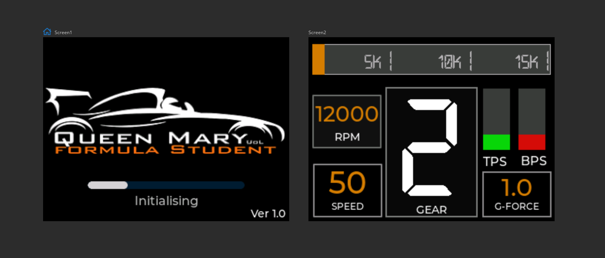

# Dashboard

## Introduction
This repoistory is for a Formula Student Dashboard project. The intent of the dashboard is to show important information about the car to the driver, such as RPM and Gear number.

## Repository Structure
.\
├── Libraries  (Directory for libraries needed for Arduino code)\
└── README.md  (This document)

## Images

### Project Contributors
Bhargav Maniar\
Raymond Zhen